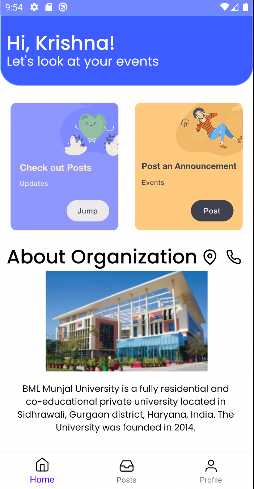

<h1>Eventify &nbsp;   &nbsp; 
</h1>

---

This is an Events app that can keep a record of all the events that are happening in a organisation and users can add more events, edit them and change their profile.

#### Note

> This is the initial stable version of the App.  
> There are many features that can be added.

#### Preview

&nbsp;
&nbsp;

#### Installation
> `git clone https://github.com/reach-the-sky/Eventify.git`  
> Add _google-services.json_ file, to connect to your firebase.

If you liked my project and appreciate the content I opensource, consider following me on github [🌥](https://github.com/reach-the-sky).
